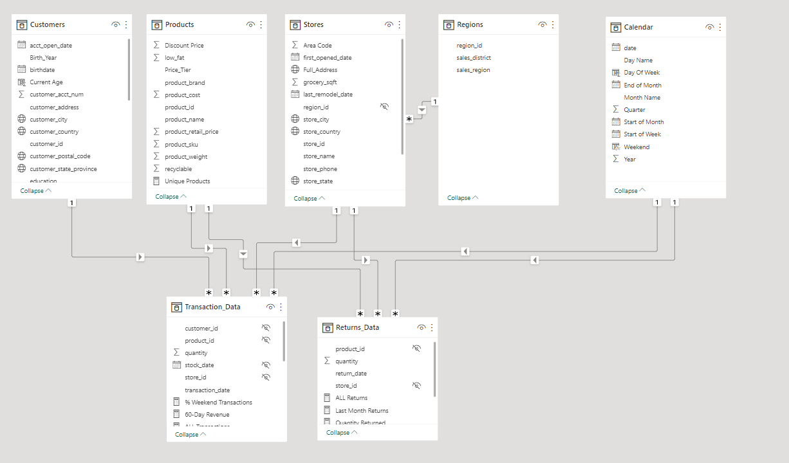
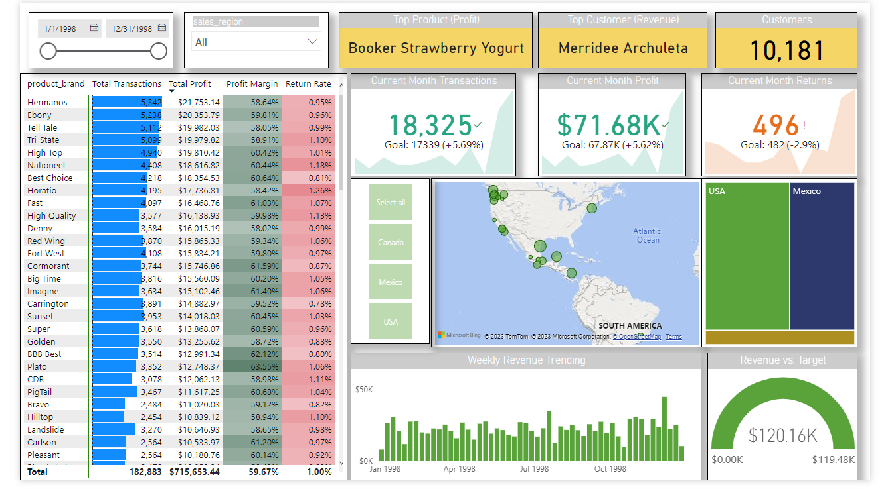

# Symorg_Sales_Analysis

## Introduction

This is a Power BI Project on sales analysis of an imaginary store called **Symorg Stores**. The project analyze and derive insights to answer crucial questions and help the store make data driven decisons.

**_Disclaimer_** : _All datasets and reports do not represent any company but hust a dummy dataset to demonstarte Power BI capabilities._

## Problem Statement

1.  What is the total sales in the current year?
2.  Which country has the highest sales in the current year?
3.  Which region has the highest sales in the current year?
4.  What is the top product by sales?

## Skills/Concepts Demonstrated:

The following Power BI features were incorporated:
- Bookmarking
- Filter
- Modelling
- Tooltips
- Page Navigation
- Data Analysis Expression (DAX)

## Modelling

There are 5-dimesion tables and 2 fact tables. The dimension tables are all joined to the fact table.

Model
:----------------------:

## Visualization
The report comprises 2 pages:
1.  Topline Peroformance
2.  Insights & Recommendation

This is the preview of the dashboard:

You can interact with the report here (https://1drv.ms/u/s!ArJ9eZQ-YoizhGlaXAV5pItBfTbO?e=awWkkY)

## Conclusions & recommendations:

- Portland reached 1,000 sales in December to close out the year.
- High Top product returns doubled in mexico (4 to 8) at a return rate of 1.2%.
- Plate products drove the tsrongest overall profit margin (63.55%) in 1998.
- The highest transactions was generated in the United States.

